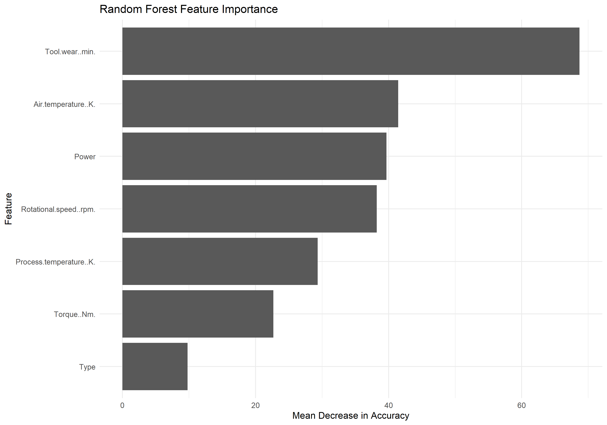
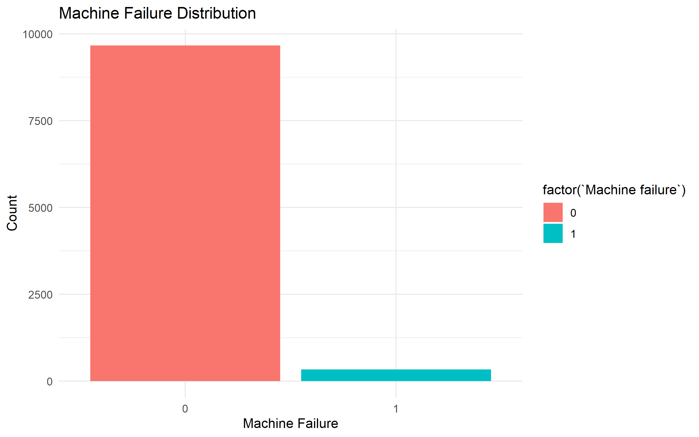
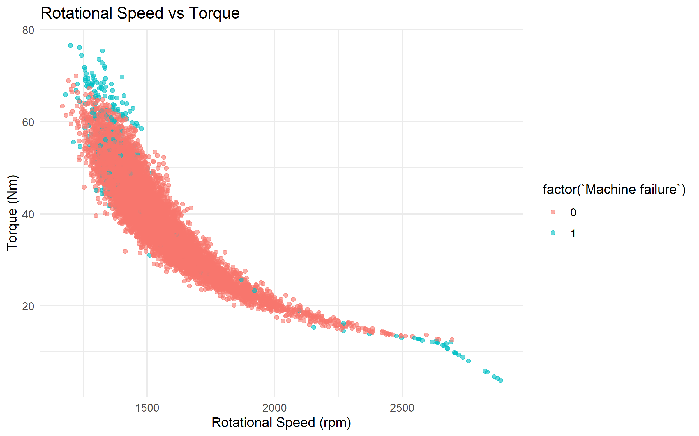
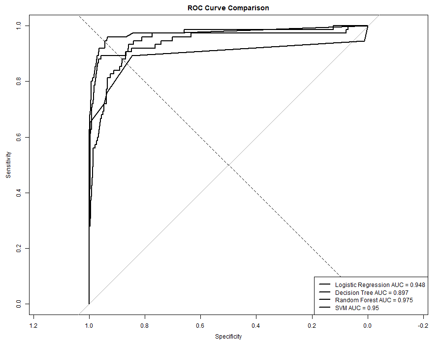
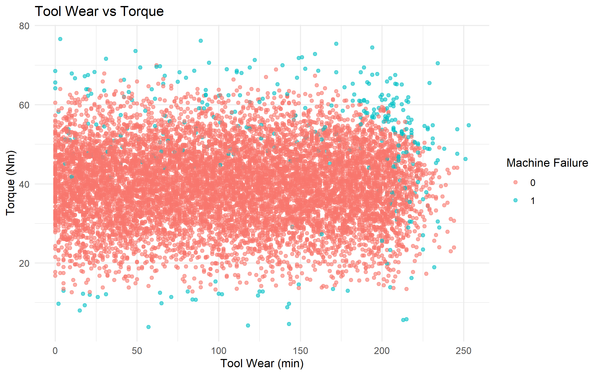

# Predictive Failure Detection in Industrial Robots Using Machine Learning in R

## 📌 Project Overview

This project develops a machine learning-based predictive maintenance system using **R** to identify potential machine failures before they occur.

The project uses the **AI4I 2020 Predictive Maintenance Dataset**, a synthetic predictive-maintenance dataset containing machine operating conditions and failure information.

Multiple machine learning algorithms are implemented and compared, followed by Random Forest hyperparameter tuning and final evaluation.

The project also includes an interactive **Shiny web application** that allows users to enter machine operating parameters and obtain a predicted failure status and failure probability.

> **Important:** The AI4I 2020 dataset is synthetic predictive-maintenance data. It is used as a proxy for industrial machine/robot failure prediction and does not represent real sensor measurements from a specific industrial robot.

---

## 🎯 Objectives

The main objectives of this project are:

* Predict whether a machine is likely to experience failure.
* Perform data cleaning and preprocessing.
* Conduct exploratory data analysis.
* Engineer additional predictive features.
* Compare different machine learning algorithms.
* Evaluate models using classification metrics.
* Compare models using ROC-AUC.
* Analyze feature importance.
* Perform Random Forest hyperparameter tuning.
* Save trained machine learning models.
* Build an interactive Shiny prediction application.
* Demonstrate how machine learning can support predictive maintenance.

---

## 🏗️ Project Workflow

```text
Dataset
   ↓
Data Loading
   ↓
Data Preprocessing
   ↓
Exploratory Data Analysis
   ↓
Feature Engineering
   ↓
Train/Test Split
   ↓
Machine Learning Models
   ├── Logistic Regression
   ├── Decision Tree
   ├── Random Forest
   └── Support Vector Machine
   ↓
Model Evaluation
   ↓
ROC-AUC Comparison
   ↓
Feature Importance
   ↓
Random Forest Hyperparameter Tuning
   ↓
Final Model
   ↓
Failure Prediction
   ↓
Shiny Web Application
```

---

## 📊 Dataset

### AI4I 2020 Predictive Maintenance Dataset

The project uses the **AI4I 2020 Predictive Maintenance Dataset**.

The dataset contains:

* 10,000 machine records
* 14 original attributes
* Machine operating conditions
* Machine failure information
* Multiple failure-mode indicators

### Original Dataset Columns

```text
UDI
Product ID
Type
Air temperature [K]
Process temperature [K]
Rotational speed [rpm]
Torque [Nm]
Tool wear [min]
Machine failure
TWF
HDF
PWF
OSF
RNF
```

### Target Variable

The target variable is:

```text
Machine failure
```

Target distribution:

| Class      |      Count | Percentage |
| ---------- | ---------: | ---------: |
| No Failure |      9,661 |     96.61% |
| Failure    |        339 |      3.39% |
| **Total**  | **10,000** |   **100%** |

The dataset is therefore highly imbalanced, which is important when interpreting model performance.

---

## 🧹 Data Preprocessing

The preprocessing stage includes:

* Loading the raw dataset.
* Checking dataset dimensions.
* Checking missing values.
* Removing unnecessary identifiers.
* Converting categorical variables appropriately.
* Preparing the target variable.
* Saving the cleaned dataset.

The following columns were removed from the final modeling dataset:

```text
UDI
Product ID
```

The cleaned dataset contains:

```text
10,000 rows × 12 columns
```

---

## ⚙️ Feature Engineering

Two additional features were created during feature engineering.

### 1. Temperature Difference

```text
Temperature_Difference =
Process Temperature - Air Temperature
```

This feature represents the difference between process temperature and surrounding air temperature.

### 2. Power

```text
Power =
Rotational Speed × Torque
```

This provides an approximate mechanical power-related feature derived from rotational speed and torque.

### Final Feature Selection

For the final machine learning models, the following predictors were used:

```text
Type
Air temperature [K]
Process temperature [K]
Rotational speed [rpm]
Torque [Nm]
Tool wear [min]
Power
```

`Temperature_Difference` was excluded from the final model because it is mathematically dependent on the two temperature variables.

The failure-mode indicators:

```text
TWF
HDF
PWF
OSF
RNF
```

were also excluded from the final predictors to reduce the risk of target leakage because they directly describe specific failure mechanisms.

---

## 🤖 Machine Learning Models

Four machine learning algorithms were implemented:

### 1. Logistic Regression

Used as a baseline classification model.

### 2. Decision Tree

Used to model nonlinear relationships through a tree-based decision structure.

### 3. Random Forest

An ensemble of decision trees used for classification and feature importance analysis.

### 4. Support Vector Machine

Used to identify a classification boundary between failure and non-failure observations.

---

## 🔀 Train/Test Split

The dataset was divided into:

```text
Training Set: 80%
Testing Set: 20%
```

A fixed random seed was used:

```r
set.seed(123)
```

This ensures reproducibility of the train/test split.

### Training Data

```text
8,000 records
```

Target distribution:

```text
No Failure: 7,736
Failure:      264
```

### Testing Data

```text
2,000 records
```

Target distribution:

```text
No Failure: 1,925
Failure:       75
```

---

## 📈 Model Performance

The models were evaluated on the held-out test set.

| Model               | Accuracy | Precision | Recall | F1 Score | ROC-AUC |
| ------------------- | -------: | --------: | -----: | -------: | ------: |
| Logistic Regression |   97.00% |    72.73% | 32.00% |   44.44% |   0.948 |
| Decision Tree       |   98.45% |    90.74% | 65.33% |   75.97% |   0.897 |
| Random Forest       |   98.65% |    96.15% | 66.67% |   78.74% |   0.975 |
| SVM                 |   97.05% |    94.44% | 22.67% |   36.56% |   0.950 |

These results are based on the project's held-out test split.

Because the dataset is highly imbalanced, accuracy alone should not be used to judge the models. Precision, recall, F1-score, balanced accuracy, and ROC-AUC are also considered.

---

## 🌲 Final Random Forest Model

Random Forest was further evaluated using different numbers of trees.

| Number of Trees | Accuracy | Precision | Recall |
| --------------: | -------: | --------: | -----: |
|             100 |   98.65% |    96.15% | 66.67% |
|             200 |   98.60% |    97.96% | 64.00% |
|             300 |   98.60% |    96.08% | 65.33% |
|             500 |   98.75% |    98.08% | 68.00% |

The final Random Forest model uses:

```text
Number of Trees = 500
```

The trained model is saved as:

```text
models/final_random_forest_model.rds
```

---

## 📊 Final Model Evaluation

The final model evaluation on the held-out test set produced:

```text
Accuracy           = 98.65%
Precision          = 96.15%
Recall             = 66.67%
Specificity        = 99.90%
F1 Score           = 78.74%
Balanced Accuracy  = 83.28%
ROC-AUC            = 0.975
```

### Confusion Matrix

```text
          Reference
Prediction    0    1
         0 1923   25
         1    2   50
```

Where:

```text
0 = No Failure
1 = Failure
```

---

## 🔍 Feature Importance

Random Forest feature importance was used to analyze which input variables contributed most strongly to the model.

The analysis includes features such as:

* Tool Wear
* Air Temperature
* Rotational Speed
* Power
* Torque
* Process Temperature
* Machine Type

The feature importance result is saved as:

```text
results/final_feature_importance.csv
```

The visualization is available at:



---

## 📊 Project Visualizations

### Feature Importance


### Machine Failure Distribution



### Rotational Speed vs Torque



### ROC Curve Comparison



### Tool Wear vs Torque



---

## 🖥️ Shiny Web Application

The project includes an interactive **Shiny** web application for machine failure prediction.

The user can enter:

* Machine Type
* Air Temperature
* Process Temperature
* Rotational Speed
* Torque
* Tool Wear

The application uses the saved Random Forest model to generate:

* Predicted failure status
* Failure probability
* No-failure probability
* Supporting visualizations

### Application Workflow

```text
User Input
    ↓
Machine Parameters
    ↓
Feature Preparation
    ↓
Final Random Forest Model
    ↓
Prediction
    ↓
Failure Probability
    ↓
Visualization
```

The application source code is:

```text
app/app.R
```

---

## 🧪 Example Prediction

One example input used in the project is:

```text
Machine Type: L
Air Temperature: 303 K
Process Temperature: 313 K
Rotational Speed: 1400 rpm
Torque: 60 Nm
Tool Wear: 240 min
```

The prediction demo produced:

```text
Machine Failure: Predicted
Failure Probability: 87.4%
No-Failure Probability: 12.6%
```

This demonstrates how the trained model can be used to estimate failure risk from machine operating parameters.

---

## 📂 Project Structure

```text
Predictive_Robot_Failure/
│
├── data/
│   ├── raw/
│   │   └── ai4i2020.csv
│   │
│   └── processed/
│       ├── ai4i2020_clean.csv
│       └── ai4i2020_feature_engineered.csv
│
├── R/
│   ├── 01_load_dataset.R
│   ├── 02_preprocessing.R
│   ├── 03_eda.R
│   ├── 04_feature_engineering.R
│   ├── 05_logistic_regression.R
│   ├── 05_ml_preparation.R
│   ├── 06_decision_tree.R
│   ├── 07_random_forest.R
│   ├── 08_svm.R
│   ├── 09_model_comparison.R
│   ├── 10_roc_auc.R
│   ├── 11_feature_importance.R
│   ├── 12_hyperparameter_tuning.R
│   ├── 13_model_evaluation.R
│   ├── 14_failure_prediction.R
│   ├── 15_visualization.R
│   ├── 16_save_final_model.R
│   ├── 17_prediction_demo.R
│   └── 18_project_check.R
│
├── models/
│   ├── logistic_model.rds
│   ├── decision_tree_model.rds
│   ├── random_forest_model.rds
│   ├── svm_model.rds
│   └── final_random_forest_model.rds
│
├── plots/
│   ├── feature_importance.png
│   ├── final_failure_distribution.png
│   ├── final_speed_torque.png
│   ├── roc_curve_comparison.png
│   └── tool_wear_vs_torque.png
│
├── results/
│   ├── auc_results.csv
│   ├── feature_importance.csv
│   ├── final_feature_importance.csv
│   ├── final_model_evaluation.csv
│   ├── hyperparameter_tuning.csv
│   └── model_comparison.csv
│
├── app/
│   └── app.R
│
└── .gitignore
```

---

## ▶️ How to Run the Project

### 1. Clone the Repository

Clone the repository and open the project in RStudio.

### 2. Install Required Packages

Run the following command in R:

```r
install.packages(c(
  "dplyr",
  "readr",
  "ggplot2",
  "caret",
  "randomForest",
  "e1071",
  "pROC",
  "shiny"
))
```

### 3. Open the Project

Open the following folder in RStudio:

```text
Predictive_Robot_Failure
```

### 4. Run the R Scripts

Run the scripts in the following sequence:

```text
01_load_dataset.R
02_preprocessing.R
03_eda.R
04_feature_engineering.R
05_ml_preparation.R
05_logistic_regression.R
06_decision_tree.R
07_random_forest.R
08_svm.R
09_model_comparison.R
10_roc_auc.R
11_feature_importance.R
12_hyperparameter_tuning.R
13_model_evaluation.R
14_failure_prediction.R
15_visualization.R
16_save_final_model.R
17_prediction_demo.R
18_project_check.R
```

### 5. Run the Shiny Application

From the project root in RStudio:

```r
shiny::runApp("app")
```

---

## 🛠️ Technologies Used

### Programming Language

* R

### Development Environment

* RStudio

### Machine Learning

* Logistic Regression
* Decision Tree
* Random Forest
* Support Vector Machine

### Data Processing

* dplyr
* readr

### Visualization

* ggplot2

### Model Evaluation

* caret
* pROC

### Application Development

* Shiny

### Model Storage

* RDS

---

## 📁 Generated Files

### Processed Data

```text
data/processed/ai4i2020_clean.csv
data/processed/ai4i2020_feature_engineered.csv
```

### Trained Models

```text
models/logistic_model.rds
models/decision_tree_model.rds
models/random_forest_model.rds
models/svm_model.rds
models/final_random_forest_model.rds
```

### Results

```text
results/auc_results.csv
results/feature_importance.csv
results/final_feature_importance.csv
results/final_model_evaluation.csv
results/hyperparameter_tuning.csv
results/model_comparison.csv
```

### Visualizations

```text
plots/feature_importance.png
plots/final_failure_distribution.png
plots/final_speed_torque.png
plots/roc_curve_comparison.png
plots/tool_wear_vs_torque.png
```

---

## 💡 Applications

The project demonstrates potential applications of machine learning in:

* Predictive maintenance
* Industrial failure detection
* Equipment monitoring
* Machine-condition analysis
* Preventive maintenance planning
* Industrial decision support
* Early identification of machine failure risk

---

## ⚠️ Limitations

This project has several limitations:

1. The AI4I 2020 dataset is synthetic.
2. The dataset does not represent measurements collected from a specific physical robot.
3. The failure class is significantly smaller than the non-failure class.
4. Model performance on this dataset may not represent performance on real industrial equipment.
5. Real-world deployment would require validated sensor data.
6. Industrial deployment would require domain-specific testing and validation.
7. Predictions should be treated as decision-support information rather than guaranteed failure outcomes.

---

## 🚀 Future Enhancements

Future versions of the project could include:

* Real industrial robot sensor datasets
* Real-time sensor monitoring
* IoT sensor integration
* Time-series failure prediction
* Deep learning models
* LSTM-based predictive maintenance
* XGBoost and LightGBM comparison
* Explainable AI using SHAP
* Real-time prediction dashboards
* Cloud deployment
* Automated maintenance alerts
* Integration with industrial monitoring systems

---

## 📚 Dataset Reference

**Dataset:** AI4I 2020 Predictive Maintenance Dataset

**Source:** UCI Machine Learning Repository

The dataset is widely used for demonstrating predictive maintenance and machine failure classification techniques.

---

## 👩‍💻 Author

**Sriyathi Dharavath**

B.E. Artificial Intelligence & Data Science
Chaitanya Bharathi Institute of Technology, Hyderabad

### Areas of Interest

* Artificial Intelligence
* Machine Learning
* Data Science
* Predictive Maintenance
* Explainable AI
* Software Development

---

## ⭐ Project Summary

This project demonstrates an end-to-end machine learning workflow for predictive maintenance using R.

The workflow covers:

```text
Data Collection
      ↓
Data Preprocessing
      ↓
Exploratory Data Analysis
      ↓
Feature Engineering
      ↓
Machine Learning
      ↓
Model Comparison
      ↓
Hyperparameter Tuning
      ↓
Feature Importance
      ↓
Final Evaluation
      ↓
Failure Prediction
      ↓
Shiny Application
```

The project provides a complete foundation for extending predictive maintenance from synthetic benchmark data toward real-world industrial machine and robotic systems.
